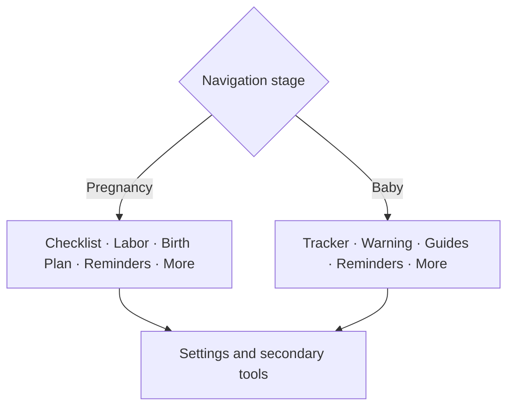
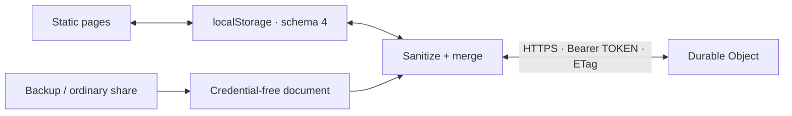
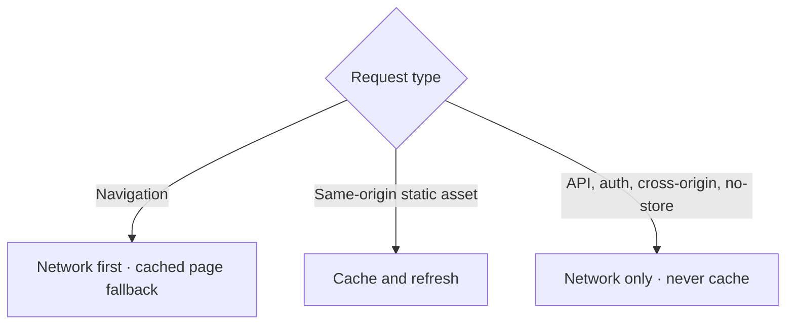
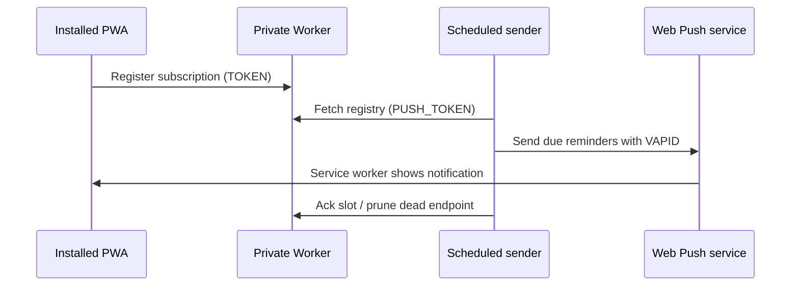

# Baby List 3.0 — architecture

Baby List is a static, offline-first PWA. The browser owns the primary copy;
the optional Worker is a private replication target, not a required backend.

## Page shell and stage navigation

`assets/app-shell.js` renders one consistent five-item bottom bar. The visible
destinations follow the selected life stage while Settings and secondary pages
remain reachable through More.

The stage defaults to Pregnancy until `born` is recorded. A Settings override
can pin Pregnancy or Baby without changing the birth date.

## Local state and synchronization

All pages use `assets/state-core.js`. It validates state, caps untrusted input,
strips prototype keys, timestamps scalar fields and entities, and records
deletion tombstones. `assets/sync-core.js` performs conditional Worker updates
and retries a merge when the server revision changed.

Conflict resolution is last-write-wins per stamped field or entity. Checked
items, notes, custom items, and tracker entries retain tombstones so an older
device cannot resurrect a deletion. The Worker rejects oversized or malformed
documents and only accepts exact configured web origins.

## Worker authorization boundary

The two tokens deliberately expose different APIs:

| Credential | Allowed operations | Forbidden operation |
|---|---|---|
| `TOKEN` | Read/push family state; register the current device subscription | List all push subscriptions |
| `PUSH_TOKEN` | List push registry; acknowledge/prune delivery records | Read or modify family state |

This keeps the scheduled sender from becoming a reader of the family document.
The push registry is stored beside state in the Durable Object but returned
only through sender-specific routes.

## Offline and cache boundary

`sw.js` precaches the static shell, clears obsolete release caches on activate,
and opens a notification's page/deep link. Sync responses and credentials are
outside the cache. Disconnect also asks the service worker to clear private
legacy caches.

## Reminder delivery

Reminder times are interpreted with each subscription's IANA timezone, including
DST. Delivery is de-duplicated by occurrence slot. GitHub's five-minute schedule
is best-effort, so this subsystem is convenience-only and must not be used for
safety-critical reminders.

## Security and privacy assumptions

- The hosting origin and Worker must use HTTPS in production.
- Whoever possesses `TOKEN` can read and edit the family document.
- Live invites contain that token and are intentionally gated by a disclosure.
- Backups and tracker archives can contain health-adjacent personal data even
  though they omit credentials.
- The emergency card is local/synced data rendered safely as text; stored user
  text is never injected as HTML.
- Medical/legal copy is versioned content with a source registry and review date,
  not a clinical decision engine.

## Test boundaries

`npm run verify` runs HTML/reference checks plus deterministic tests for state
sanitization and deletion merging, ETag conflict retries, calendar-day and
rolling tracker math, Worker token isolation/revisions, and timezone-aware push
selection. Visual/device checks remain part of `POST-DEPLOY.md`.
