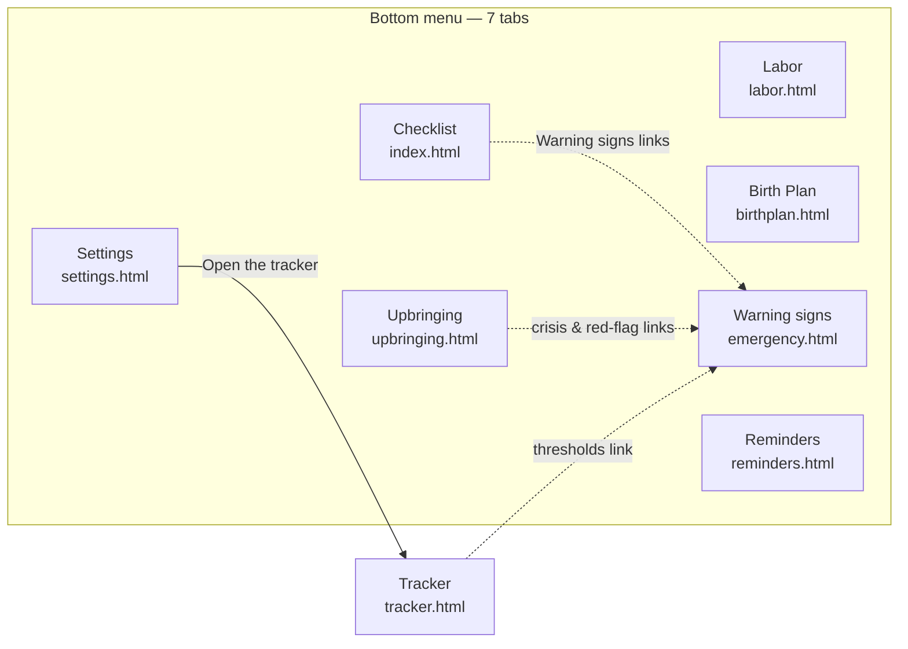
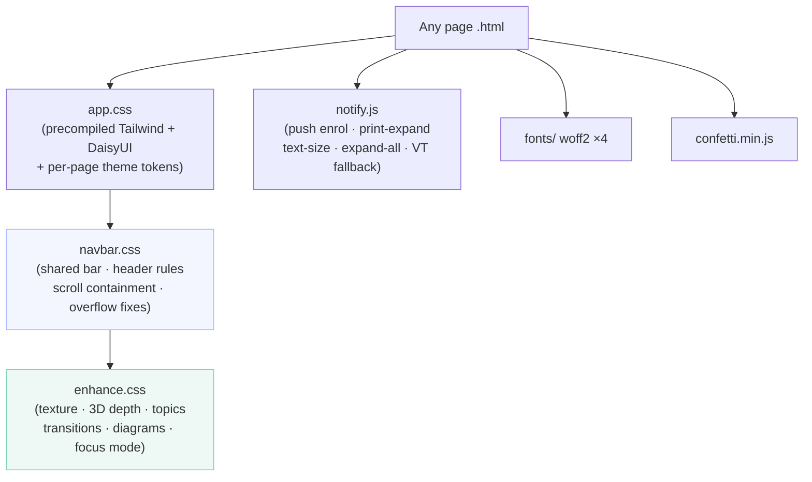
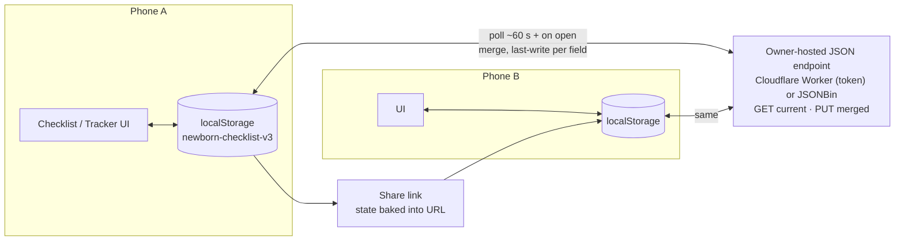
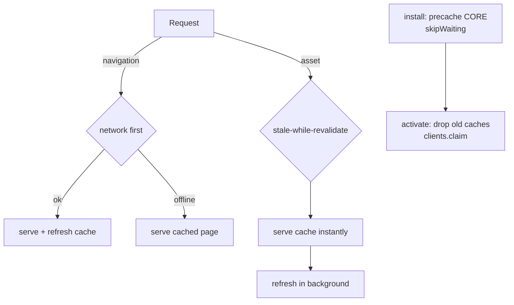
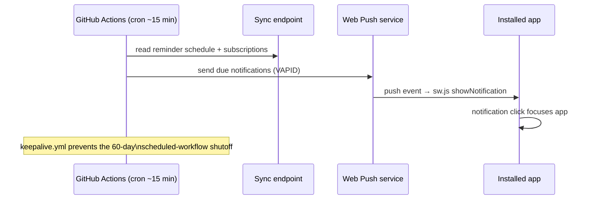

# Baby List — Architecture

A zero-build, offline-first PWA: eight static HTML pages sharing three
stylesheets and one helper script, a service worker for offline + push, and an
owner-hosted JSON endpoint for cross-device sync. GitHub renders the diagrams
below natively.

## 1 · Pages & navigation

## 2 · Assets & load order

Asset links carry a `?v=` version so fresh HTML always pulls matching CSS/JS
on the first load after a deploy.

## 3 · Data flow & sync

## 4 · Service worker strategy

## 5 · Push reminders (closed-app)

